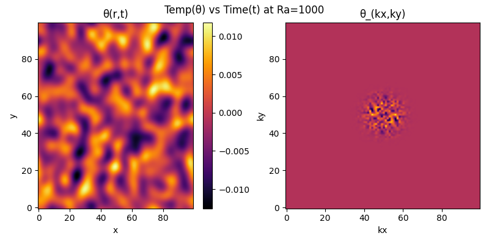

# Skeleton
This project is developed during a course at [IMTEK-Simulation](https://www.imtek.de/laboratories/simulation) under the supervision of Dr. Andreas Greiner (Assistants / group leaders at [University of freiburg](https://uni-freiburg.de/)). This project mainly aims to implement Spectral simulation methods in solving partial differential equations like Rayleigh Benard heat convection. We use [Numpy](https://numpy.org/), [Matplotlib](https://matplotlib.org/) for the computation.

# Simulations
* Thermal propagation: 
 

       

